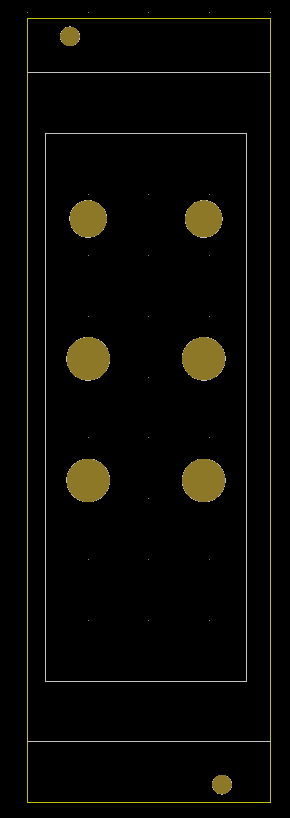
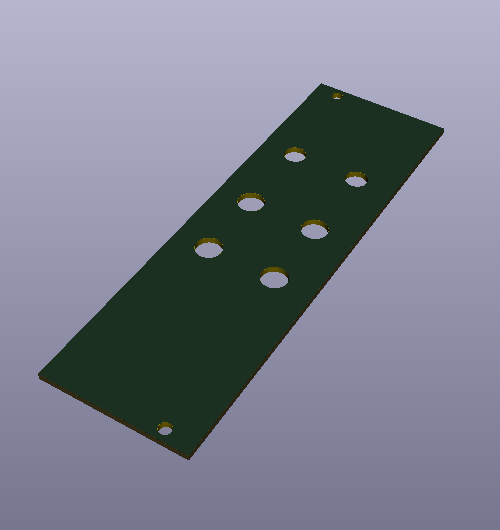

# euroKi
Simple script for making eurorack face plates. Shows the rails and where your PCB is going to live. 

```bash
git clone https://github.com/Machine-Hum/euroKi
cd euroKi
python example.py

```

```python
import shutil
import pdb
from operator import add
import euroki

# Example Front module
# ---------------------------------------------------------------------
er = euroki.euroKi('NewModule') # Give the pj a name
er.drawOutline(8) # 8 HP module
er.drawMountingHoles()
er.drawRails()

er.pot = 7.1 # Alpha 9mm pots
er.jack = 6.1 # Thonk 3.5mm jack
er.initPCB([33, 90]) # This is the PCB that will go behind the panel
er.drawPCB() # Draw this

# Now Just draw jacks and pots where you want
er.drawPot([7, 33])
er.drawPot([26, 33])
er.drawPot([7, 53])
er.drawPot([26, 53])
er.drawJack([7, 76])
er.drawJack([26, 76])

er.fin() # Cleanup
# ---------------------------------------------------------------------

```

<br>

